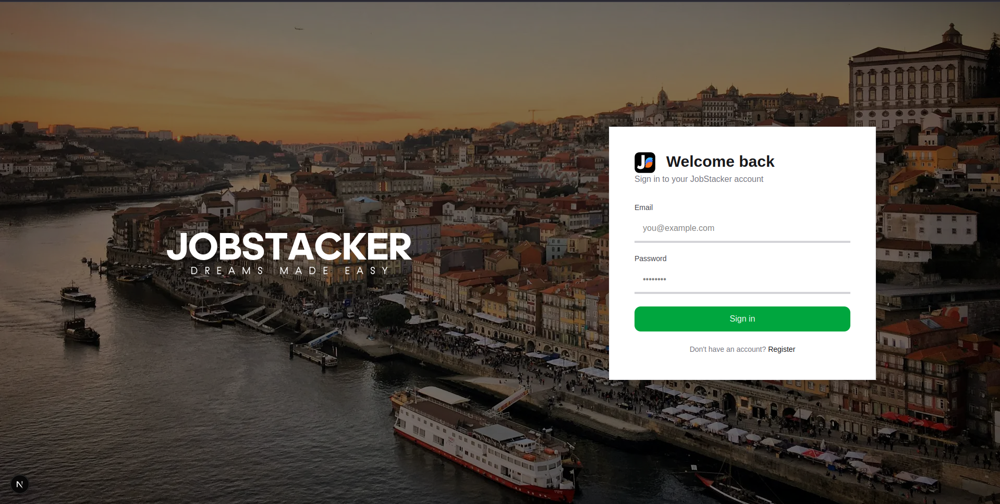
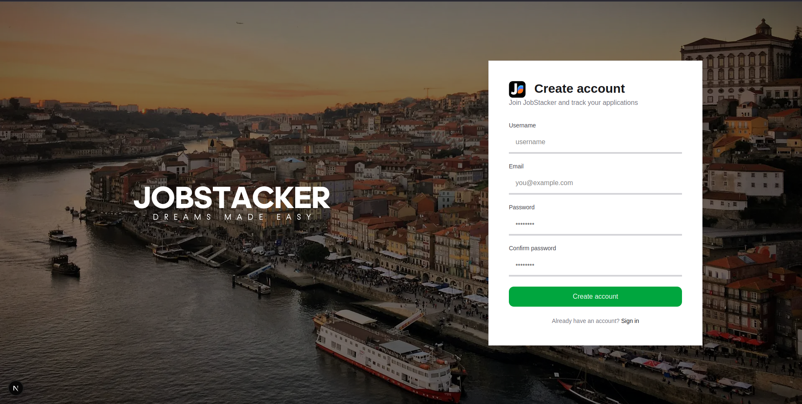

# JobStacker

A full-stack web application to track and organize job applications. Keep all your applications, interviews, and statuses in one place.

## Tech Stack

| Layer      | Technology                     |
|------------|--------------------------------|
| Frontend   | Next.js 16, React 19, TypeScript, Tailwind CSS |
| Backend    | Node.js, Express 5             |
| Database   | PostgreSQL, Sequelize ORM      |
| Auth       | JWT, bcrypt                    |
| Docs       | Swagger / OpenAPI 3.0          |
| CI         | GitHub Actions                 |

## Screenshots

### Login


### Register


## API Reference

Interactive docs available at `http://localhost:3001/api-docs` when the backend is running.

### Auth

#### `POST /auth/register`
Register a new user.

**Request body**
```json
{
  "username": "john",
  "email": "john@example.com",
  "password": "mypassword123"
}
```

**Responses**
| Status | Description |
|--------|-------------|
| `201`  | User created — returns `{ token, user }` |
| `400`  | Missing required fields |
| `409`  | Email or username already in use |
| `500`  | Internal server error |

---

#### `POST /auth/login`
Login with email and password.

**Request body**
```json
{
  "email": "john@example.com",
  "password": "mypassword123"
}
```

**Responses**
| Status | Description |
|--------|-------------|
| `200`  | Login successful — returns `{ token, user }` |
| `400`  | Missing required fields |
| `401`  | Invalid credentials |
| `500`  | Internal server error |

---

The `token` returned from both endpoints is a JWT. Pass it in the `Authorization` header for protected routes:
```
Authorization: Bearer <token>
```

## Database Schema


### Tables

**Users** — Registered users of the platform.
| Column        | Type         | Constraints          |
|---------------|--------------|----------------------|
| id            | INTEGER      | PK, Auto Increment   |
| username      | VARCHAR(255) | UNIQUE, NOT NULL     |
| email         | VARCHAR(255) | UNIQUE, NOT NULL     |
| password_hash | VARCHAR(255) | NOT NULL             |
| created_at    | TIMESTAMP    | DEFAULT now()        |

**Roles** — Available user roles (e.g. user, admin).
| Column      | Type        | Constraints          |
|-------------|-------------|----------------------|
| id          | INTEGER     | PK, Auto Increment   |
| name        | VARCHAR(50) | UNIQUE, NOT NULL     |
| description | TEXT        |                      |

**User Roles** — Maps users to their roles (many-to-many).
| Column      | Type      | Constraints          |
|-------------|-----------|----------------------|
| user_id     | INTEGER   | PK, FK → users(id)   |
| role_id     | INTEGER   | PK, FK → roles(id)   |
| assigned_at | TIMESTAMP | DEFAULT now()        |

**Companies** — Companies where jobs are listed.
| Column   | Type         | Constraints          |
|----------|--------------|----------------------|
| id       | INTEGER      | PK, Auto Increment   |
| title    | VARCHAR(255) | UNIQUE, NOT NULL     |
| location | VARCHAR(255) |                      |

**Jobs** — Job listings tied to a company.
| Column     | Type          | Constraints                        |
|------------|---------------|------------------------------------|
| id         | INTEGER       | PK, Auto Increment                 |
| company_id | INTEGER       | FK → companies(id)                 |
| title      | VARCHAR(255)  | NOT NULL                           |
| description| TEXT          |                                    |
| url        | TEXT          |                                    |
| salary     | DECIMAL(10,2) |                                    |
| work_mode  | ENUM          | 'remote', 'hybrid', 'onsite'       |

**Applications** — Tracks a user's application to a job.
| Column     | Type      | Constraints                                          |
|------------|-----------|------------------------------------------------------|
| id         | INTEGER   | PK, Auto Increment                                   |
| user_id    | INTEGER   | FK → users(id)                                       |
| job_id     | INTEGER   | FK → jobs(id)                                        |
| status     | ENUM      | 'applied', 'interviewing', 'rejected', 'offered', 'ghosted' |
| applied_at | TIMESTAMP | DEFAULT now()                                        |

**Interviews** — Interview rounds for an application.
| Column          | Type         | Constraints                                              |
|-----------------|--------------|----------------------------------------------------------|
| id              | INTEGER      | PK, Auto Increment                                       |
| application_id  | INTEGER      | FK → applications(id)                                    |
| round_type      | VARCHAR(255) |                                                          |
| scheduled_start | TIMESTAMP    | NOT NULL                                                 |
| scheduled_end   | TIMESTAMP    | NOT NULL                                                 |
| status          | ENUM         | 'scheduled', 'completed', 'canceled', 'passed', 'failed'|
| notes           | TEXT         |                                                          |

### Relationships

```
User ──<< UserRole >>── Role
  │
  └──< Application >── Job ──> Company
            │
            └──< Interview
```

- A **User** has many **Roles** (through UserRole)
- A **Role** has many **Users** (through UserRole)
- A **User** has many **Applications**
- A **Job** belongs to a **Company**
- An **Application** belongs to a **User** and a **Job**
- An **Interview** belongs to an **Application**

## Getting Started

### Prerequisites

- Node.js (v18+)
- PostgreSQL

### Setup

**1. Clone the repository**
```bash
git clone <your-repo-url>
cd JobStacker
```

**2. Backend**
```bash
cd backend
npm install
```

Create a `.env` file in `backend/`:
```env
DEV_DB_USER=your_db_user
DEV_DB_PASS=your_db_password
DEV_DB_NAME=jobstacker
DEV_DB_HOST=localhost
DEV_DB_PORT=5432
```

Run database migrations:
```bash
npx sequelize-cli db:migrate
```

Start the server:
```bash
npm run dev
```

**3. Frontend**
```bash
cd frontend
npm install
npm run dev
```

## Project Structure

```
JobStacker/
├── .github/
│   └── workflows/
│       └── ci.yml           # GitHub Actions CI pipeline
├── backend/
│   ├── config/              # Database configuration
│   ├── migrations/          # Sequelize migrations
│   ├── models/              # Sequelize models
│   ├── seeders/             # Database seed data
│   ├── src/
│   │   ├── __tests__/       # Integration tests (Jest + Supertest)
│   │   ├── controllers/     # Route handlers
│   │   ├── routes/          # Express routes
│   │   ├── app.js           # Express app
│   │   ├── server.js        # Server entry point
│   │   └── swagger.js       # OpenAPI config
│   └── .env                 # Environment variables (not committed)
├── frontend/
│   ├── app/
│   │   ├── login/           # Login page
│   │   ├── register/        # Register page
│   │   └── layout.tsx
│   └── public/              # Static assets
└── docs/
    ├── schema.png           # Database schema diagram
    ├── auth-login.png       # Login page screenshot
    └── auth-register.png    # Register page screenshot
```


